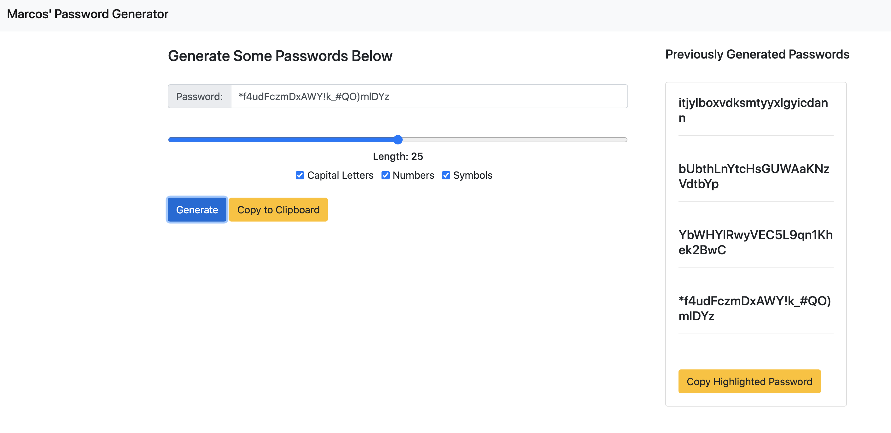

# Bootcamp-Week-3

##Screenshot of Website

## Link to Live

https://github.com/marcos-cmd/Password-Generator

## GitHub URL

https://marcos-cmd.github.io/Password-Generator/

## Functions of Password Generator
1. Slider that changes the character length of generated password
2. Generate Button that generates a new password
3. Copy to Clipboard button that copies the most recently generated password
4. Alert for successful copies
5. Alert disappears after 3 seconds
6. Previously generated passwords show up in additional card
7. Button that will copy a highlighted previous password of your choice

